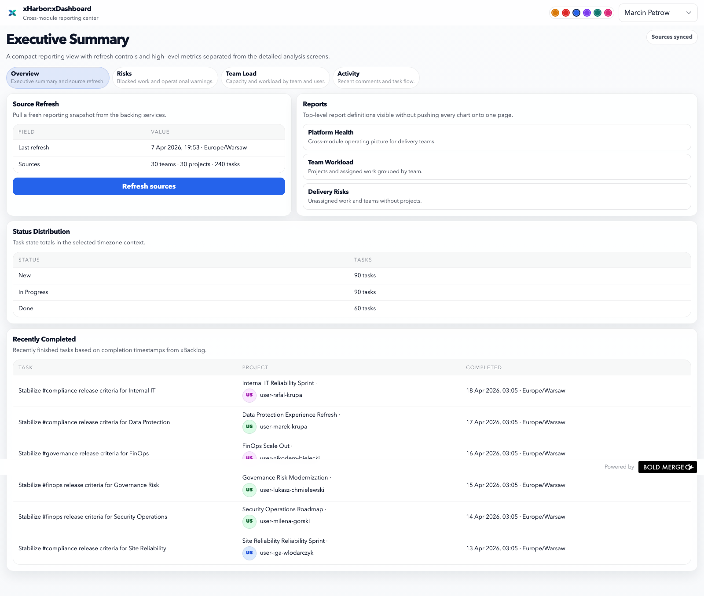
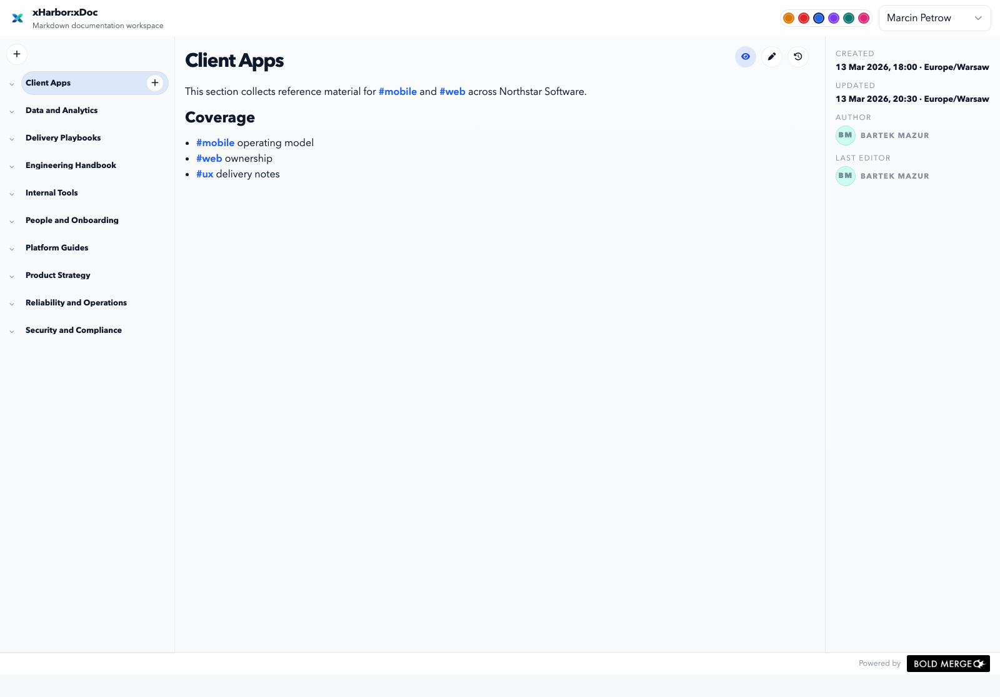

# xHarbor Wiki

This wiki is the fast path into the platform. It complements the product and architecture docs with practical guides, module overviews, and UI references from the running apps.

The current web platform also shares one browser shell in `apps/_shared-web`. That layer keeps navigation, avatars, preferences, CRUD scaffolding, routing helpers, and common interaction wiring aligned across apps.

## Start here

- [Getting started](getting-started.md)
- [Local development](local-development.md)

## Module guides

- [xGroup](modules/xgroup.md)
- [xBacklog](modules/xbacklog.md)
- [xDashboard](modules/xdashboard.md)
- [xTalk](modules/xtalk.md)
- [xTag](modules/xtag.md)
- [xDoc](modules/xdoc.md)

## UI reference gallery

### xGroup


### xBacklog


### xDashboard



### xTalk


### xDoc



## Screenshot workflow

Regenerate the screenshots used in this wiki with:

```bash
npx playwright install chromium
npm run docs:screenshots
```
