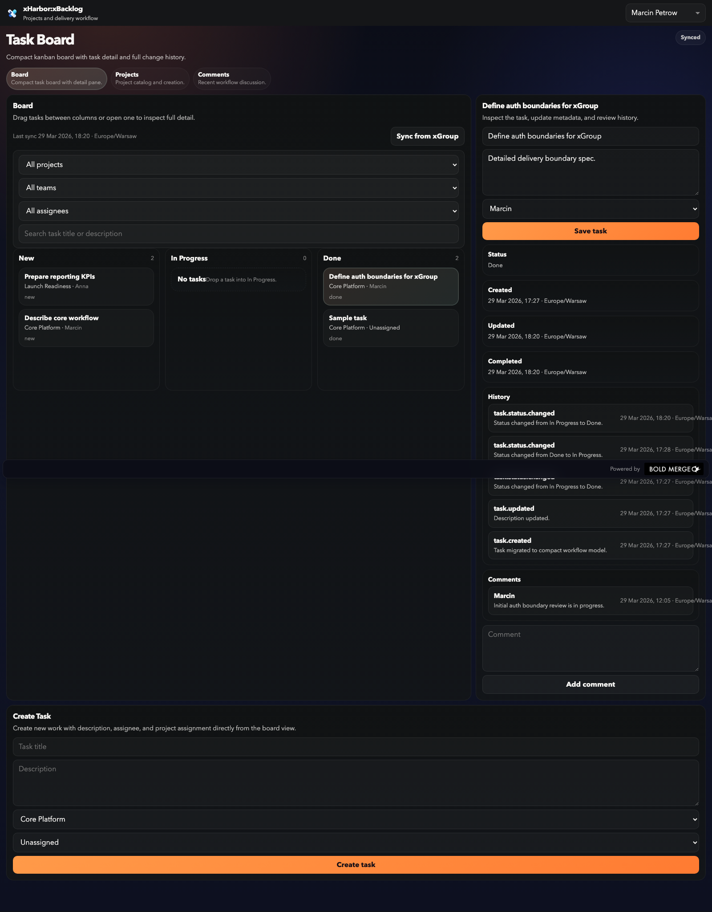

# xBacklog

`xBacklog` is the planning and execution surface for delivery work. It consumes workspace structure from `xGroup` and keeps projects, tasks, comments, and change history in one focused flow.

## Responsibilities

- project ownership by team
- task board with `new`, `in_progress`, and `done`
- task detail with description, assignee, and timestamps
- comments and task history
- board filtering and drag-and-drop workflow

## Main views

- `Board` for day-to-day task movement
- `Projects` for project creation and maintenance
- `Comments` for recent workflow discussion

## Notes

`xBacklog` is designed as a compact execution tool rather than a general dashboard. The board keeps task movement and task detail close together, while projects and comments stay in separate views.
