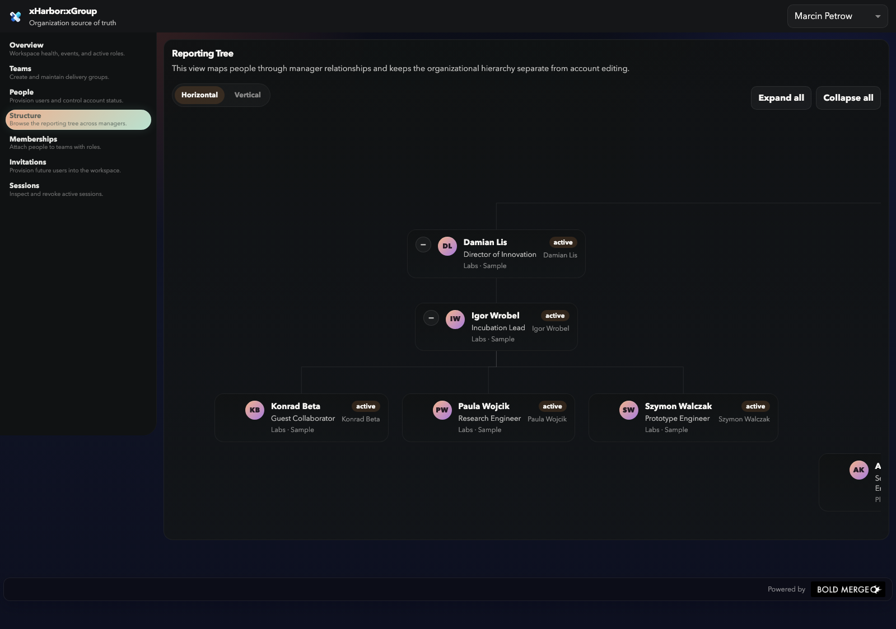

# xGroup

`xGroup` is the organizational backbone of xHarbor. It owns people, teams, memberships, invitations, sessions, and reporting structure for the rest of the platform.

## Responsibilities

- team and people directory
- memberships and role assignments
- invitations and account lifecycle
- session administration
- reporting tree and manager relationships

## Main views

- `Overview` for workspace state and recent events
- `Teams` for team creation and maintenance
- `People` for account lifecycle and profile data
- `Structure` for the reporting chart
- `Memberships` for team-role assignment
- `Invitations` for onboarding future users
- `Sessions` for active session inspection and revocation

## Notes

The `Structure` view is the best place to validate seeded workspace data. It supports horizontal and vertical layouts, collapse and expand controls, drag navigation, and path highlighting through the reporting chain.
