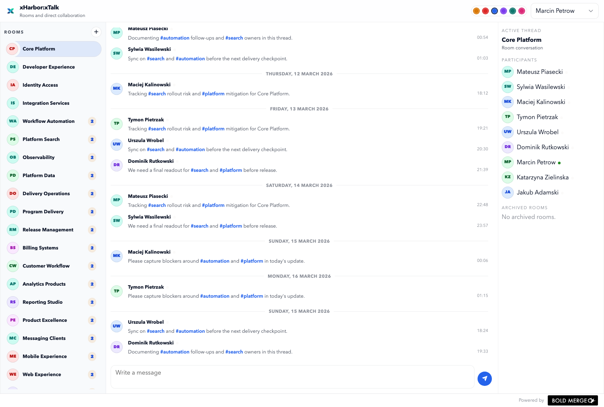

# xTalk

`xTalk` is the communication module for xHarbor. It runs as both a web app and a native macOS client and shares the same underlying chat model.

## Responsibilities

- team rooms
- direct messages
- unread state and read markers
- session-aware presence
- shared web and native chat flows

## Main views

- `Chat` for rooms and direct conversations

## Notes

The web and macOS clients are designed to stay behaviorally aligned. Presence is session-aware, direct messages and rooms share the same left-rail navigation pattern, and the web client now leans on the shared shell for delegated actions, form handling, and route/query sync instead of app-local interaction wiring.
